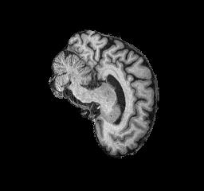
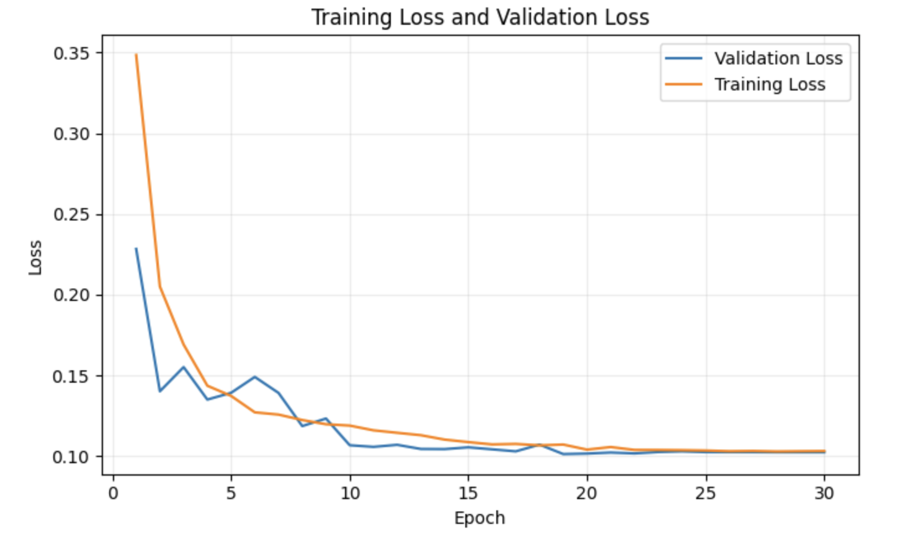
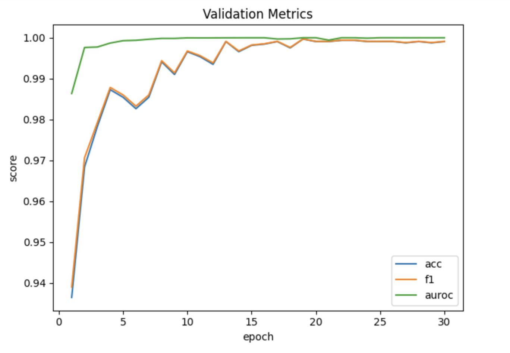
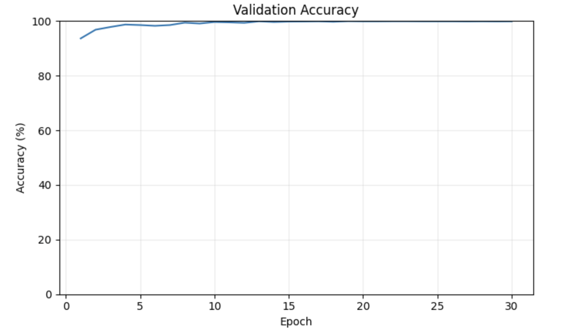

# Alzheimer's Disease Classification with ConvNeXt-Tiny (AD vs NC)
**Student Number:** 48906962

**Name:** Tom Van Loon

**Description:** 
This project fine-tunes ConvNeXt-Tiny (ImageNet-1K pretrained) to classify MRI slices as Alzheimer’s Disease (AD) vs Normal Control (NC). It includes reproducible data loading, a mixed-precision training loop, validation-based threshold selection (Youden’s J / best-F1), and a small evaluation script.


## Introduction to ConvNeXt-Tiny

### The Algorithm
ConvNeXt-Tiny is a modern convolutional neural network that “modernizes” a ResNet-style backbone with design cues from Vision Transformers (e.g., larger depthwise kernels, inverted bottlenecks, LayerNorm, and stochastic depth). ConvNeXt keeps a pure-ConvNet hierarchy (patchifying stem → four stages of blocks → global pooling → linear head) and has shown ImageNet-level performance competitive with transformer backbones while remaining efficient and scalable. In this project the model is adapted for binary classification of ADNI MRI slices (Alzheimer’s Disease vs Normal Control) using a class-weighted cross-entropy objective and validation-tuned decision thresholds.


### How it works
Input MR images are resized/normalized to match the ImageNet pretraining statistics, then passed through a patchify stem (4×4, stride 4) to create low-resolution feature maps. The network applies a sequence of ConvNeXt blocks—each block uses a depthwise 7×7 convolution, LayerNorm, a 1×1 expansion (GELU), and a 1×1 projection (with residual connection)—with stage transitions that downsample spatially while increasing channel width. Global average pooling aggregates features; a dropout-regularized linear layer outputs logits for the two classes. During training we optimize with AdamW and a cosine LR schedule; during evaluation we convert logits to probabilities, pick an operating threshold from validation (Youden or best-F1), and report accuracy/F1/AUROC on test.

## Problem & Approach (What it solves, how it works)
**Problem:** Distinguishing AD from NC in MRI is challenging due to subtle anatomical changes and class imbalance.
**Approach:** We replace ConvNeXt-Tiny's classifier with `Dropout(0.5) -> Linear(2)` and fine-tune using AdamW, Cosine LR, label smoothing, and class-weighted cross-entropy. During training we track AUROC, F1, and Accuracy, save the best checkpoint by validation AUROC, then choose a decision threshold on validation (Youden / best-F1) before reporting on test.

## Project Structure
```python
├── dataset.py        # datasets, transforms, val split, dataloaders
├── modules.py        # model/loss builders, train/eval, plotting, thresholds
├── train.py          # training script → best.pt, history.json, figures
├── predict.py        # evaluate a checkpoint on a folder
├── requirements.txt  # pinned versions
└── AD_NC/
    ├── train/AD/   train/NC/
    └── test/AD/    test/NC/
```

## Pre-Processing & Augmentations
- **Input size / Resize:** `RandomResizeCrop(224, scale=(0.9, 1.0))` keeps most anatomy while adding slight scale variation for robustness
- **Light Geometric Augments:** `RandomHorizontalFlip(p=0.5)` and `RandomRotation(±10°)` provide invariance to small pose differences without distorting anatomy
- **Normalization (ImageNet stats):** `mean=[0.485, 0.456, 0.406]`, `std=[0.229, 0.224, 0.225]`. Matching ConvNeXt's pretraining distribution speeds convergence and stabilises fine-tuning

## Split Justification
- **Test Set:** remains untouched and is used only once, at the end, to estimate the trained model's performance against unseen data. The model never witnesses test images during development, so the reported test metric are not inflated.
- **Validation Set:** is 15% of the total files within the train set. Validation sets below 10% can be too noisy for reliable model selection, but above 20%, there may be too great a sacrifice of training data, hence 15% is an appropriate middle ground.
- **Training Set:** is the large majority of samples used for learning, which helps reduce the variance in fitted weights.

## Dependencies
```python
Python: 3.12
torch: 2.4.1
torchvision: 0.19.1
timm: 1.0.9
torchmetrics: 1.4.2
scikit-learn: 1.5.1
matplotlib: 3.9.2
seaborn: 0.13.2
numpy: 1.26.4
```

## Reproducibility
Seeding is used to ensure that the same sequence of pseudorandomly generated numbers are used in training, within Python, NumPy and Torch.

## Example Dataset Input Images

- Example of Patient with Alzheimer's Disease (`218391_78.jpeg`)



- Example of Normal Control Patient (without Alzheimer's Disease) (`808819_88.jpeg`)


## Results








## Evaluation

- **The training and validation fall together and remain close**, from early epochs, as seen in the Training Loss and Validation Loss graph. This indicates that the optimiser is stable, and that after 15-20 epochs, there are diminishing returns.
  
- **Unusually high validation accuracy** suggests that either the validation set is very easy and unrepresentative, or, the split leaks information.
  
- **Test score was 75.0%** which, in corroboration with the unusually hgih validation accuracy, suggests that some information from the training set may have leaked into the validation set, through near-duplicate images from the same subject.

